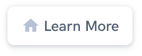

<h1 align="center" style="border-bottom: none !important; margin-bottom: 5px !important;"><a href="https://designrevision.com/downloads/shards-dashboard-lite-react/">Product hunts Dashboard</a></h1>

A free React admin dashboard template pack featuring a modern design system    and lots of custom templates and components.

  
  

 

 

### Project Structure

- This project is bootstrapped using [Create React App](https://github.com/facebook/create-react-app).
- **Flux** is used for state management and all Flux specific files are located inside `src/flux`. Transitioning to a more robust solution such as Redux is also fairly simple.
- All primary templates are located inside `src/views`.
- There is only one single layout defined (Default) inside `src/layouts`, however, the current structure provides an easy way of extending the UI kit. 
- The `src/components` directory hosts all template-specific subcomponents in their own subdirectory.
- The layout styles inherited from Shards Dashboard are pulled in from the `src/shards-dashboard` submodule inside `src/App.js`.
- Other extra styles specific to the libraries used are located inside `src/assets`.
- The `src/utils` directory contains generic Chart.js utilities.

 
 

### Built using

- [Shards React](https://github.com/designrevision/shards-react)
- [Chart.js](https://www.chartjs.org/)
- [Flux](https://facebook.github.io/flux/)
- [No UI Slider](https://refreshless.com/nouislider/)
- [React Datepicker](https://www.npmjs.com/package/react-datepicker)
- [Quill](https://quilljs.com/)

 

### Changelog

Please check out the [CHANGELOG](CHANGELOG.md).
